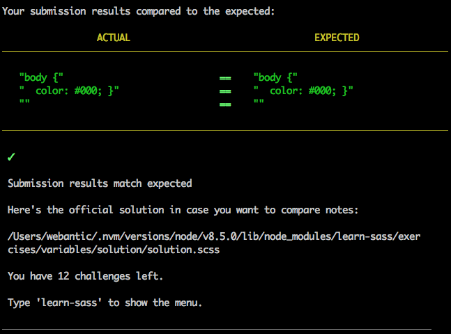

## Learn Sass with npm package learn-sass
_Sass_ is what is known as a _CSS preprocessor_ - effectively a layer on top of CSS that allows us to use features that don't exist in CSS yet. We write our code in Sass, run it through the Sass compiler which translates our fancy Sass markup into ordinary CSS, and this gets piped into a new CSS file.

<details>
<summary>Learn Sass with npm package learn-sass</summary>
<p>

Read about some of the Sass features [here](https://sass-lang.com/guide).

### `learn-sass`
To teach you the basics of Sass, there's a really useful npm package called `learn-sass`. To install it run:
```bash
npm install -g learn-sass
```
Once you've installed, create a project folder called `learn-sass`.

Run `learn-sass` by in the Terminal:
```bash
learn-sass
```
### Additional Reading
- [Why Sass?](https://alistapart.com/article/why-sass)
- [Sass on Codecademy](https://www.codecademy.com/learn/learn-sass)

</p>
</details>

---

#### Variables
```scss
$primary-color: #000;

body {
  color: $primary-color;
}
```

<details>
<summary>Variables</summary>
<p>

Think of variables as a way to store information that you want to reuse
throughout your stylesheet. You can store things like colors, font stacks,
or any CSS value you think you'll want to reuse. Sass uses the $ symbol to
make something a variable. Here's an example:
```scss
    $font-stack:    Helvetica, sans-serif;
    $primary-color: #333;

    body {
    font: 100% $font-stack;
    color: $primary-color;
    }
```
When the Sass is processed, it takes the variables we define for the
$font-stack and $primary-color and outputs normal CSS with our variable
values placed in the CSS. This can be extremely powerful when working with
brand colors and keeping them consistent throughout the site.
```scss
     body {
       font: 100% Helvetica, sans-serif;
       color: #333;
     }
```

</p>
</details>

---

#### Nesting
```scss
nav {
    ul {
        margin: 0;
        }
    aside {
        text-decoration: red;
        }
    }
```

<details>
<summary>Nesting</summary>
<p>

When writing HTML you've probably noticed that it has a clear nested and
visual hierarchy. CSS, on the other hand, doesn't. Here's an example of
some typical styles for a site's navigation:
```scss
    nav {
    ul {
        margin: 0;
        padding: 0;
        list-style: none;
    }

    li { display: inline-block; }

    a {
        display: block;
        padding: 6px 12px;
        text-decoration: none;
    }
    }
```
You'll notice that the ul, li, and a selectors are nested inside the nav
selector. This is a great way to organize your CSS and make it more
readable. When you generate the CSS you'll get something like this:
```scss
    nav ul {
    margin: 0;
    padding: 0;
    list-style: none;
    }

    nav li {
    display: inline-block;
    }

    nav a {
    display: block;
    padding: 6px 12px;
    text-decoration: none;
    }
```

</p>
</details>

---

#### Imports
```scss
@import 'importsreset';
```

<details>
<summary>Imports</summary>
<p>

CSS has an import option that lets you split your CSS into smaller, more
maintainable portions. The only drawback is that each time you use @import
in CSS it creates another HTTP request. Sass builds on top of the current
CSS @import but instead of requiring an HTTP request, Sass will take the
file that you want to import and combine it with the file you're importing
into so you can serve a single CSS file to the web browser.

Let's say you have a couple of Sass files, _reset.scss and base.scss. We
want to import _reset.scss into base.scss.
```scss
    // _reset.scss

    html,
    body,
    ul,
    ol {
    margin: 0;
    padding: 0;
    }

    // base.scss

    @import 'reset';

    body {
    font: 100% Helvetica, sans-serif;
    background-color: #efefef;
    }
```
Notice we're using @import 'reset'; in the base.scss file. When you import
a file you don't need to include the file extension .scss. Sass is smart
and will figure it out for you. When you generate the CSS you'll get:
```scss
    html, body, ul, ol {
    margin: 0;
    padding: 0;
    }

    body {
    font: 100% Helvetica, sans-serif;
    background-color: #efefef;
    }
```

</p>
</details>

---

#### Mixins
```scss
@mixin border($thickness) {
    -webkit-border-width: $thickness;
       -moz-border-width: $thickness;
        -ms-border-width: $thickness;
            border-width: $thickness;
  }

.img { @include border-width(10px); }
```

<details>
<summary>Mixins</summary>
<p>

Some things in CSS are a bit tedious to write, especially with CSS3 and
the many vendor prefixes that exist. A mixin lets you make groups of CSS
declarations that you want to reuse throughout your site. You can even
pass in values to make your mixin more flexible. A good use of a mixin is
for vendor prefixes. Here's an example for border-radius.
```scss
    @mixin border-radius($radius) {
    -webkit-border-radius: $radius;
        -moz-border-radius: $radius;
        -ms-border-radius: $radius;
            border-radius: $radius;
    }

    .box { @include border-radius(10px); }
```
To create a mixin you use the @mixin directive and give it a name. We've
named our mixin border-radius. We're also using the variable $radius
inside the parentheses so we can pass in a radius of whatever we want.
After you create your mixin, you can then use it as a CSS declaration
starting with @include followed by the name of the mixin. When your CSS is
generated it'll look like this:
```scss
    .box {
    -webkit-border-radius: 10px;
    -moz-border-radius: 10px;
    -ms-border-radius: 10px;
    border-radius: 10px;
    }
```

</p>
</details>

---

#### Mixin Content
```scss
$img: solid;

@mixin img($new-border-style: solid) {
  border-width: $new-border-style;
  @content;
  border-width: $new-border-style;
}

.img {
  @include img {
    img: $img;
  }
}
```

<details>
<summary>Mixin Content</summary>
<p>

Passing Content Blocks to a Mixin

It is possible to pass a block of styles to the mixin for placement within
the styles included by the mixin. The styles will appear at the location
of any @content directives found within the mixin. This makes it possible
to define abstractions relating to the construction of selectors and
directives.

For example:
```scss
    $color: white;

    @mixin colors($new-color: blue) {
    background-color: $new-color;
    @content;
    border-color: $new-color;
    }

    .colors {
    @include colors {
        color: $color;
    }
    }
```
Generates:
```scss
    .colors {
    background-color: blue;
    color: white;
    border-color: blue;
    }
```
Note: when the @content directive is specified more than once or in a
loop, the style block will be duplicated with each invocation.

</p>
</details>

---

#### Extend/Inheritance
```scss
.push-button {
background-color: blue;
}

.main-button {
@extend .push-button;
font-weight: bold;
}
```

<details>
<summary>Extend/Inheritance</summary>
<p>

This is one of the most useful features of Sass. Using @extend lets you
share a set of CSS properties from one selector to another. It helps keep
your Sass very DRY. In our example we're going to create a simple series
of messaging for errors, warnings and successes.
```scss
    .message {
    border: 1px solid #ccc;
    padding: 10px;
    color: #333;
    }

    .success {
    @extend .message;
    border-color: green;
    }

    .error {
    @extend .message;
    border-color: red;
    }

    .warning {
    @extend .message;
    border-color: yellow;
    }
```
What the above code does is allow you to take the CSS properties in
.message and apply them to .success, .error, & .warning. The magic happens
with the generated CSS, and this helps you avoid having to write multiple
class names on HTML elements. This is what it looks like:
```scss
    .message, .success, .error, .warning {
    border: 1px solid #cccccc;
    padding: 10px;
    color: #333;
    }

    .success {
    border-color: green;
    }

    .error {
    border-color: red;
    }

    .warning {
    border-color: yellow;
    }
```

</p>
</details>

---

#### Operators
```scss
$page-width: 1400px;
$padding: 20px;

.container {
  padding: $padding;
  width: 0.8 * $page-width - 2 * $padding;
}
```

<details>
<summary>Operators</summary>
<p>

Doing math in your CSS is very helpful. Sass has a handful of standard
math operators like +, -, *, /, and %. In our example we're going to do
some simple math to calculate widths for an aside & article.
```scss
.container { width: 100%; }

article[role="main"] {
    float: left;
    width: 600px / 960px * 100%;
}

aside[role="complimentary"] {
    float: right;
    width: 300px / 960px * 100%;
}
```
We've created a very simple fluid grid, based on 960px. Operations in Sass
let us do something like take pixel values and convert them to percentages
without much hassle. The generated CSS will look like:
```scss
.container {
    width: 100%;
}

article[role="main"] {
    float: left;
    width: 62.5%;
}

aside[role="complimentary"] {
    float: right;
    width: 31.25%;
}
```

</p>
</details>

---

#### Nested Properties
```scss
.sassy {
    border {
        width: 10px;
        color: red;
        radius: 5px;
    }
}
```

<details>
<summary>Nested Properties</summary>
<p>

CSS has quite a few properties that are in “namespaces;” for instance,
font-family, font-size, and font-weight are all in the font namespace. In
CSS, if you want to set a bunch of properties in the same namespace, you
have to type it out each time. Sass provides a shortcut for this: just
write the namespace once, then nest each of the sub-properties within it.
For example:
```scss
    .funky {
    font: {
        family: fantasy;
        size: 30em;
        weight: bold;
    }
    }
```
is compiled to:
```scss
    .funky {
    font-family: fantasy;
    font-size: 30em;
    font-weight: bold; }
```
The property namespace itself can also have a value. For example:
```scss
    .funky {
    font: 20px/24px fantasy {
        weight: bold;
    }
    }
```
is compiled to:
```scss
    .funky {
    font: 20px/24px fantasy;
        font-weight: bold;
    }
```

</p>
</details>

---

#### Parent Selector
```scss
#button {
  color: black;
  a {
    &:focus { color: red; }
  }
}
```

<details>
<summary>Parent Selector</summary>
<p>

Sometimes it’s useful to use a nested rule’s parent selector in other ways
than the default. For instance, you might want to have special styles for
when that selector is hovered over or for when the body element has a
certain class. In these cases, you can explicitly specify where the parent
selector should be inserted using the & character.

& will be replaced with the parent selector as it appears in the CSS. This
means that if you have a deeply nested rule, the parent selector will be
fully resolved before the & is replaced. For example:
```scss
    #main {
    color: black;
    a {
        font-weight: bold;
        &:hover { color: red; }
    }
    }

is compiled to:

    #main {
    color: black; }
    #main a {
        font-weight: bold; }
        #main a:hover {
        color: red; }
```

</p>
</details>

---

#### Interpolation
```scss
$selector: article;

#{$selector} {
    $color: #ff0000;
}
```

<details>
<summary>Interpolation</summary>
<p>

You can also use SassScript variables in selectors and property names
using #{} interpolation syntax:
```scss
    $name: foo;
    $attr: border;
    p.#{$name} {
    #{$attr}-color: blue;
    }
```
is compiled to:
```scss
    p.foo {
    border-color: blue; }
```
It’s also possible to use #{} to put SassScript into property values. In
most cases this isn’t any better than using a variable, but using #{} does
mean that any operations near it will be treated as plain CSS. For
example:
```scss
    p {
    $font-size: 12px;
    $line-height: 30px;
    font: #{$font-size}/#{$line-height};
    }
```
is compiled to:
```scss
    p {
    font: 12px/30px; }
```

</p>
</details>

---

#### Each Iterator
```scss
@each $big-cat in cheetah, puma, jaguar, panther, tiger, leopard {
    .#{$big-cat}-picture {
        background-image: url('/images/#{$big-cat}.png');
        padding: 3em;
    }
}
```

<details>
<summary>Each Iterator</summary>
<p>

The @each directive usually has the form @each $var in <list or map>. $var
can be any variable name, like $length or $name, and <list or map> is a
SassScript expression that returns a list or a map.

The @each rule sets $var to each item in the list or map, then outputs the
styles it contains using that value of $var. For example:
```scss
    @each $animal in puma, sea-slug, egret, salamander {
    .#{$animal}-icon {
        background-image: url('/images/#{$animal}.png');
    }
    }
```
is compiled to:
```scss
    .puma-icon {
    background-image: url('/images/puma.png'); }
    .sea-slug-icon {
    background-image: url('/images/sea-slug.png'); }
    .egret-icon {
    background-image: url('/images/egret.png'); }
    .salamander-icon {
    background-image: url('/images/salamander.png'); }
```

</p>
</details>

---

#### For Loop
```scss
@for $i from 1 through 6 {
    .h#{$i} { font-size: 24px * $i; }
}
```

<details>
<summary>For Loop</summary>
<p>

The @for directive repeatedly outputs a set of styles. For each
repetition, a counter variable is used to adjust the output. The directive
has two forms: @for $var from <start> through <end> and @for $var from
<start> to <end>. Note the difference in the keywords through and to. $var
can be any variable name, like $i; <start> and <end> are SassScript
expressions that should return integers. When <start> is greater than
<end> the counter will decrement instead of increment.

The @for statement sets $var to each successive number in the specified
range and each time outputs the nested styles using that value of $var.
For the form from ... through, the range includes the values of <start>
and <end>, but the form from ... to runs up to but not including the value
of <end>. Using the through syntax,
```scss
    @for $i from 1 through 3 {
    .item-#{$i} { width: 2em * $i; }
    }
```
is compiled to:
```scss
    .item-1 {
    width: 2em; }
    .item-2 {
    width: 4em; }
    .item-3 {
    width: 6em; }
```

</p>
</details>

---

#### While Loop
```scss
$i: 1;
@while $i < 7 {
  .h#{$i} { font-size: 24px - 3px * $i; }
  $i: $i - 1;
}
```

<details>
<summary>While Loop</summary>
<p>

The @while directive takes a SassScript expression and repeatedly outputs
the nested styles until the statement evaluates to false. This can be used
to achieve more complex looping than the @for statement is capable of,
although this is rarely necessary. For example:
```scss
    $i: 6;
    @while $i > 0 {
    .item-#{$i} { width: 2em * $i; }
    $i: $i - 2;
    }
```
is compiled to:
```scss
    .item-6 {
    width: 12em; }

    .item-4 {
    width: 8em; }

    .item-2 {
    width: 4em; }
```

</p>
</details>

#### [Return: Express README](../../README.md)
