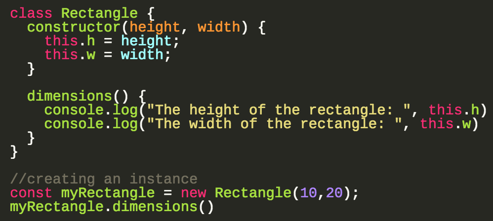

___Class in terms of Object-oriented Programming is a blueprint for creating objects. A class encapsulates data and functionality for the object.___

#### ES6 Class Syntax
Previously in JavaScript, there were no official classes. Types were defined by functions. We had to create a function and then define methods on the function object using the prototype:
```js
function Vacation(destination, length) {
    this.destination = destination
    this.length = length
}
Vacation.prototype.print = function() {
    console.log(this.destination + " | " + this.length + " days")
}

var maui = new Vacation("Maui", 7);
maui.print(); // Maui | 7
```
ES6 introduces class declaration, but JavaScript still works the same way. Functions are objects, and inheritance is handled through the prototype:
```js
class Vacation {
constructor(destination, length) {
    this.destination = destination
    this.length = length
}
print() {
    console.log(`${this.destination} will take ${this.length} days.`)
    }
}

const trip = new Vacation("Santiago, Chile", 7);
console.log(trip.print()); // Chile will take 7 days.
```

#### [Return: Express README](../../README.md)
