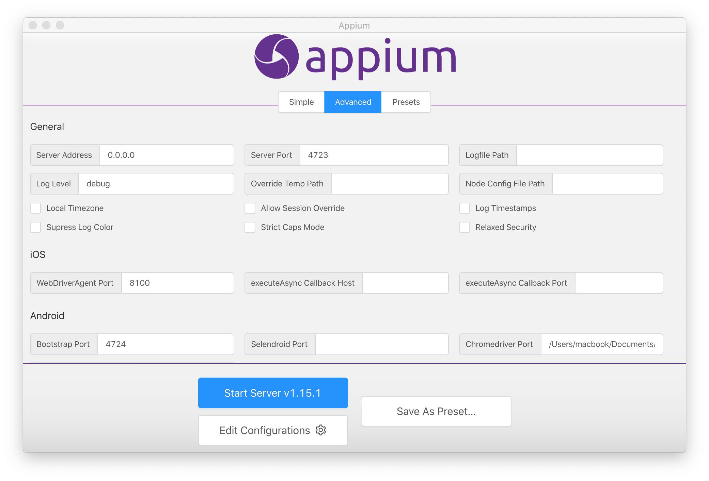
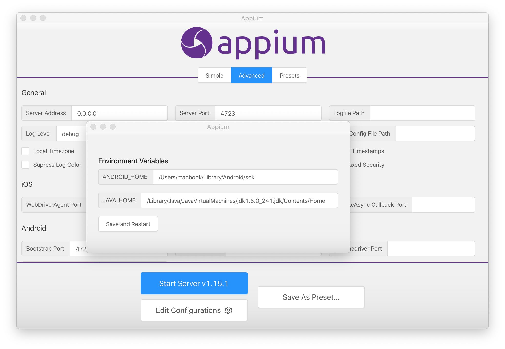

## Basic Appium Desktop GUI Setup

___Appium Desktop is a new open source GUI application for Windows, Mac, and Linux which gives you the power of the Appium automation server in a more organized manner with a flexible UI.___

Appium Desktop is a combination of two essential components of Appium:
- Appium Server: Server instance for enabling testing (and test automation) of apps.Appium
- Inspector: For inspecting and getting all the details of UI elements of your apps.

### Troubleshooting

#### installing appium cmd

Following console error message is shown if unable to install chromedriver provided by Appium due to permission:

```bash
Failed at the appium-chromedriver@4.21.0 postinstall script.
```

Use the following command to overwrite permission issue:
```bash
npm install -g appium --unsafe-perm=true --allow-root
```

#### chromedriver issue

Following console error message is shown if the chromedriver provided by Appium is incompatible with the Android web browser:

```bash
this version of chromedriver only supports chrome version XX appium
```
Simply download the correct version and provide the path in the Chromedriver Binary Path field:



#### java issue
If Appium is unabel to locate JAVA_PATH, firstly check and verify path by executing the following command via the terminal:

```bash
touch ~/.bash_profile; open ~/.bash_profile
```

Once the path has been verifed, provide this path to Appium via Edit Configurations:



[appium-desktop](https://github.com/appium/appium-desktop/releases)

#### [Return: Express README](../../README.md)
