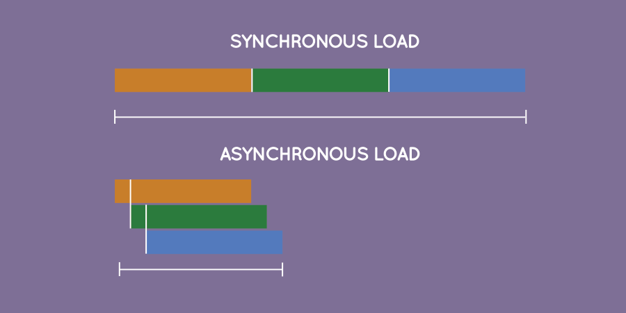

## Asynchronous programming

___Async is a utility module which provides straight-forward, powerful functions for working with asynchronous JavaScript.___

In javascript, any blocking code (I/O operations, network operations, etc.), is run in a different pool, so that the remaining code can be executed asynchronously. This way, the waiting time and execution time is reduced a lot. But it also changes the programming methodologies. The completion of execution of such asynchronous calls are handled through callback functions. [Conti..](http://ketangupta.in/blog/development/2018/01/19/async-auto/)

---

Synchronous programming means that, barring conditionals and function calls, code is executed sequentially from top-to-bottom, blocking on long-running tasks such as network requests and disk I/O.

Asynchronous programming means that the engine runs in an event loop. When a blocking operation is needed, the request is started, and the code keeps running without blocking for the result. When the response is ready, an interrupt is fired, which causes an event handler to be run, where the control flow continues. In this way, a single program thread can handle many concurrent operations.

User interfaces are asynchronous by nature, and spend most of their time waiting for user input to interrupt the event loop and trigger event handlers.
Node is asynchronous by default, meaning that the server works in much the same way, waiting in a loop for a network request, and accepting more incoming requests while the first one is being handled.
This is important in JavaScript, because it is a very natural fit for user interface code, and very beneficial to performance on the server.
```js
// Example 1 - Synchronous (blocks)
var result = database.query("SELECT * FROM hugetable");
console.log("Query finished");
console.log("Next line");

// Example 2 - Asynchronous (doesn't block) 
database.query("SELECT * FROM hugetable", function(result) {
    console.log("Query finished");
});
console.log("Next line");
```
First example, the program will block in the first line. The next line (console.log) will have to wait.

Second example, the console.log will be executed WHILE the query is being processed. That is, the query will be processed in the background, while your program is doing other things.

[JavaScript — from callbacks to async/await](https://medium.freecodecamp.org/javascript-from-callbacks-to-async-await-1cc090ddad99)

##### [Return: Express README](../README.md)
