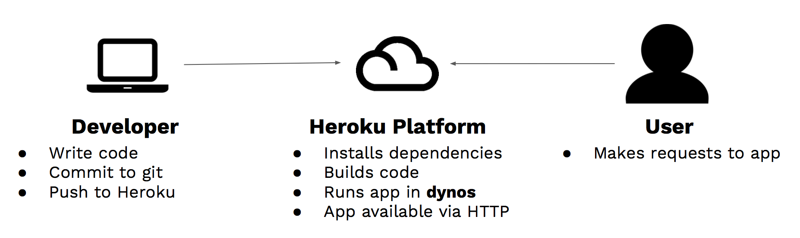

## Heroku - Cloud Application platform
___Heroku is a multi-language cloud application platform that enables developers to deploy, scale, and manage their applications.___

Heroku is a cloud platform as a service (PaaS) for Ruby, Node.js, Python, Go, PHP, and JVM-based applications, where developers manage their applications without the need for servers or administration. It features Git-based, GitHub, and API deployment strategies. Applications on Heroku are managed with Git. Simply pushing your codebase to Heroku is all it takes to deploy your application.

- Developer friendly - CLI and web console for managing apps
- Data-storage via add-ons
- Works with all major programming languages
- Allows us to build applications quickly and cheaply (i.e free)

Applications that are run on Heroku typically have a unique domain (typically `applicationname.herokuapp.com`) used to route HTTP requests to the correct dyno. Each of the application containers, or dynos, are spread across a "dyno grid" which consists of several servers.

#### Heroku And Git
One of the reasons Heroku is easy for people to use is that it relies on a widely used Git revision control system. In fact, you can’t deploy an app on Heroku unless you are using Git. The `push` command, `Heroku push master`, is what you input on the command line to send the app from your repository to the cloud. That’s why Heroku is considered a <b>one click</b> deploy.

#### Heroku Workflow


#### Deploying Your Site
First, you need to navigate to your project in the command prompt and then initialize, add, and commit via git:
```bash
# git to initialize a version of the site you want to deploy
git init
# The add . means add all the files to the git repository
git add .
# Then you want to commit with a message describing what you’ve done
git commit -m "My site ready for deployment."
```
Second, you want to create your site on Heroku. If you’re already logged in (because you ran heroku login earlier), you can issue the following command:
```bash
# Insert your desired name instead of my-static-site-example.
heroku create my-static-site-example
# If the name isn’t taken you can deploy your site using git.
git push heroku master
```
Once you see “remote: Verifying deploy…. done.” You can now visit your site at `https://<whatever-name-you-selected>.herokuapp.com/`.

[Heroku](https://www.heroku.com/)

[How to Deploy a Static Website to Heroku](https://medium.com/@adityaniloi/how-to-deploy-a-static-website-to-heroku-49d55e07cb94)

[How to Deploy a Node.js App to Heroku](https://scotch.io/tutorials/how-to-deploy-a-node-js-app-to-heroku)

#### [Return: Express README](../README.md)
