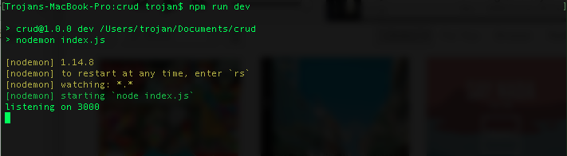

Tired of restarting your server every time you make a change? You can fix this problem by using a package called Nodemon.

#### Adding Nodemon
You can install Nodemon by running npm install nodemon --save-dev. Then edit your package.json like this:
```json
"scripts": {
  "dev": "nodemon index.js"
},
```
Now run npm run dev in your terminal, and you should see:
```bash
> nodemon index.js

[nodemon] 1.14.8
[nodemon] to restart at any time, enter `rs`
[nodemon] watching: *.*
[nodemon] starting `node index.js`
listening on 3000
```
Now with Nodemon set up, you won't have to restart your server whenever you make a change. However, you will need to refresh your browser to see those changes.

### [Return: Express README](../README.md)
