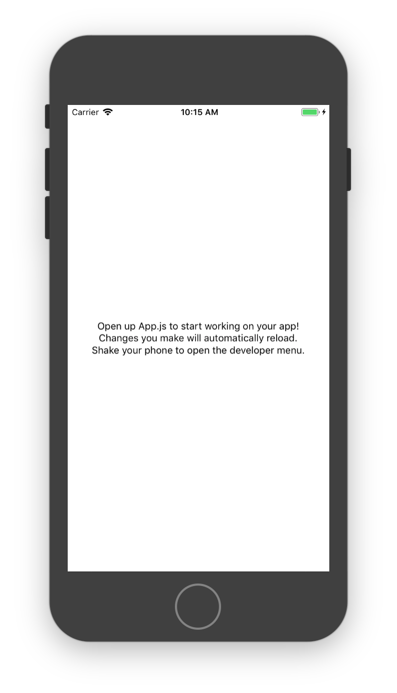

## Getting started with React Native
___Build native mobile apps using JavaScript and React.___

React Native lets you build mobile apps using only JavaScript. It uses the same design as React, letting you compose a rich mobile UI from declarative components.
- Build native mobile apps using JavaScript and React; build mobile apps using only JavaScript. It uses the same design as React, letting you compose a rich mobile UI from declarative components.
- A React Native app is a real mobile app: With React Native; build a real mobile app that's indistinguishable from an app built using Objective-C, Java, or Swift. React Native uses the same fundamental UI building blocks as regular iOS and Android apps. You just put those building blocks together using JavaScript and React.
- Don't waste time recompiling; you can reload your app instantly. With hot reloading, you can even run new code while retaining your application state.
- Use native code when you need to; combines smoothly with components written in Objective-C, Java, or Swift. It's simple to drop down to native code if you need to optimize a few aspects of your application.

#### React-Native doesn’t use HTML
Alternative components are provided to render the app. Those React-Native components map the actual real native iOS or Android UI components that get rendered on the app.

Most components provided can be translated to something similar in HTML, where for example a `<View>` component is similar to a `<div>`, and a `<Text>` component is similar to a `<p>`.
```js
import React, { Component } from 'react';
import { View, Text } from 'react-native';

export default class App extends Component {
  render() {
    return (
      <View style={styles.container}>
        <Text style={styles.intro}>Hello world!</Text>
      </View>
    );
  }
}
```
Because your code doesn’t get rendered in an HTML page, this also means you won’t be able to reuse any libraries you previously used with ReactJS that renders any kind of HTML, SVG or Canvas.

#### Expo.io
Expo apps are React Native apps which contain the Expo SDK. The SDK is a native-and-JS library which provides access to the device's system functionality. That means you don't need to use Xcode or Android Studio, or write any native code, and it also makes your pure-JS project very portable because it can run in any native environment containing the Expo SDK.

#### Running React Native with Expo
There are two tools that you need to develop apps with Expo: a local development tool and a mobile client to open your app.
1. Desktop Tool: XDE
XDE stands for Expo Development Environment. It is a standalone desktop app that includes all dependencies you'll need to get started.
2. Mobile Client: iOS simulator
Install Xcode through the Apple App Store. It'll take a while, go have a nap. Next, open up Xcode, go to preferences and click the Components tab, install a simulator from the list.
3. Launch Visual Code and XDE
In terminal, type `npm run ios` will open project in the iOS simulator.



[React Native](https://facebook.github.io/react-native/)

[Expo.io](http://expo.io/)

#### [Return: Express README](../README.md)
