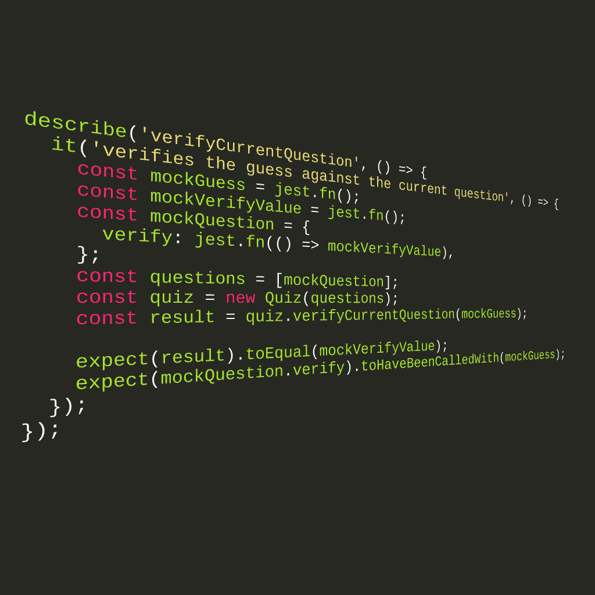

## Stub functions

___A stub method is a method that just returns a simple but valid (though not necessarily correct) result.___

Stub functions are typically functions which have been defined but have no real code in them. For example the function below might be a stub:
```js
string printMessage() {
  return "";
}
```
This function really does nothing but return an empty string. It is a stub, as in a place where we will fill in code later but have not done it yet.

Stubs are a type of test double but slightly more complex than mocks in that they are essentially "fake" objects that having matching properties and/or methods that our real objects would have. As long as the object's property names and value types (the interface) matches then we can successfully use stubs in place of our other objects in order to further isolate our test suites.

#### Vending Machine Example
Main code to be called by the test unit:
```js
function VendingMachine () {
  this.snacks = [];
  this.totalPrice = 0;
}
VendingMachine.prototype.addSnack = function addSnack (snack) {
  this.snacks.push(snack)
}
VendingMachine.prototype.purchaseSnack = function purchaseSnack (snack) {
  this.totalPrice += snack.getPrice()
}
function Snack (name, price) {
  this.name = name
  this.price = price
}
Snack.prototype.getPrice = function getPrice (snack) {
  return this.price
}
```
Before applying stubs to test unit:
```js
test('snack can be added', () => {
  const vendingMachine = new VendingMachine();
  const snack = new Snack('Caramac Bar');
  vendingMachine.addSnack(snack);
  expect(vendingMachine.snacks).toContain(snack);
})
```
Stubs applied to the test unit:
```js
test('snack can be added', () => {
  const vendingMachine = new VendingMachine();
  const snack = { name: 'Caramac Bar' };
  vendingMachine.addSnack(snack);
  expect(vendingMachine.snacks).toContain(snack);
})
```
Method added to stubs function in the test unit:
```js
test('snack can be purchased', () => {
  const vendingMachine = new VendingMachine();
  const snack = { name: 'Caramac Bar', getPrice: () => 0.79 };
  vendingMachine.purchaseSnack(snack);
  expect(vendingMachine.total).toBe(0.79);
})
```

[Mock Functions](https://facebook.github.io/jest/docs/en/mock-function-api.html)

### [Return: Express README](../README.md)
