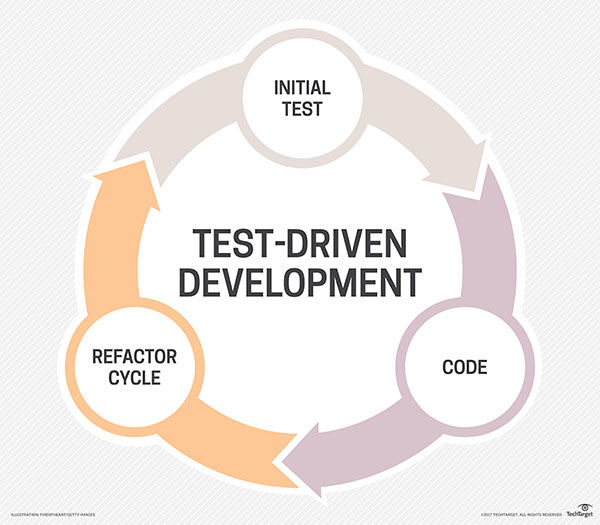

## Test-Driven Development
Writing a test before writing the code means that the test will fail, however it is a clear directive for what to add to your program next. And that's the brilliance of test-driven development.

`Test-driven development` (TDD) starts with developing test for each one of the features. The test might fail as the tests are developed even before the development. Development team then develops and refactors the code to pass the test. The primary goal of Test-driven development is to make the code clearer, simple and bug free.

Test-Driven Development Process:
- Add a Test
- Run all tests and see if the new test fails
- Write some code
- Run tests and Refactor code
- Repeat

__Add a test;__ each new feature begins with writing a test. To write a test, the developer must clearly understand the feature's specification and requirements. The developer can accomplish this through use cases and user stories to cover the requirements and exception conditions.

__Run all tests and see if the new test fails;__ this validates that the test harness is working correctly, shows that the new test does not pass without requiring new code because the required behavior already exists, and it rules out the possibility that the new test is flawed and will always pass. The new test should fail for the expected reason.

__Write the code;__ next step is to write some code that causes the test to pass. The new code written at this stage is may be not perfect, the only purpose is to pass the test, this is acceptable because it will be improve in `refactor` process. The programmer must not write code that is beyond the functionality that the test checks.

__Run tests;__ if all test cases now pass, the programmer can be confident that the new code meets the test requirements, and does not break or degrade any existing features. If they do not, the new code must be adjusted until they do.

__Refactor code;__ the growing code base must be cleaned up regularly during test-driven development. New code can be moved from where it was convenient for passing a test to where it more logically belongs. Duplication must be removed. Object, class, module, variable and method names should clearly represent their current purpose and use, as extra functionality is added. As features are added, method bodies can get longer and other objects larger. They benefit from being split and their parts carefully named to improve readability and maintainability, which will be increasingly valuable later in the software lifecycle.

__Repeat;__ starting with another new test, the cycle is then repeated to push forward the functionality. The size of the steps should always be small. If new code does not rapidly satisfy a new test, or other tests fail unexpectedly, the programmer should undo or revert in preference to excessive debugging.

[Test-driven development](https://en.wikipedia.org/wiki/Test-driven_development)

[What is it and how do you use it?](https://airbrake.io/blog/sdlc/test-driven-development)

[TDD Terminology Simplified](https://code.tutsplus.com/articles/tdd-terminology-simplified--net-30626)

[Image Source](http://searchsoftwarequality.techtarget.com/definition/test-driven-development)

### [Return: Express README](../README.md)
