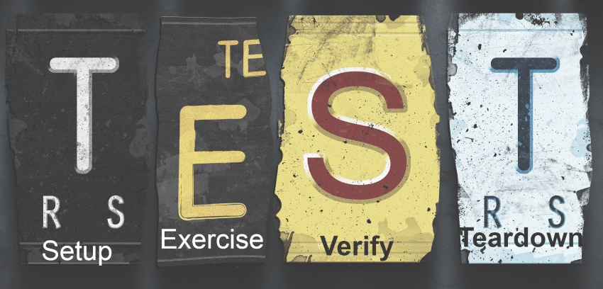

# Four-Phase Test
If a test is written with no care, it can be difficult to maintain and even progress with the test. It is important to be able to quickly determine what behavior the test is verifying. `Four-phase test` is one of the basic Unit Testing patterns and it usually defines the four phases needed to have a well-organized Unit testing class.

- __Setup__, establish the preconditions to the test.
- __Exercise__, do something to the system.
- __Verify__, check the expected outcome.
- __Teardown__, return the system under test to its initial state after the test.

The purpose of the four phases pattern is to make it easy to understand what behavior a test is verifying. `Setup` always defines the test’s precondition, `exercise` actually invokes the behavior under test, `verify` specifies the expected outcome and `teardown` is all about housekeeping. This clean phase separation signals the intention of a single test clearly and increases readability.

### Using Four-Phase Test with an User Story.
Here we have a user story from an [cruise ship](https://github.com/SharifCoding/cruise-ships) assignment:
```
As a cruise ship captain,
So I can get passengers started on their journey,
I want a ship to be able to set sail from a port.
```
The line we look at here is:
```
I want a ship to be able to set sail from a port.
```
Translated the user story to domain model:

| Object | Methods | Properties   |
|--------|---------|--------------|
| ship   | setSail | startingPort |

A `setSail` method has been assumed from the doing words `set sail` in the user story. Apply the four-phase test:
- setup `const ship = new Ship('Dover');`
- exercise `ship.setSail();`
- verify `expect(ship.startingPort).toBeFalsy();`
- teardown - Jest handles teardown for us automatically

Finally create a test unit:
```js
describe('setSail', () => {
  it('able to set sail from a port', () => {
    const ship = new Ship('Dover');

    ship.setSail();
    
    expect(ship.startingPort).toBeFalsy();
  });
});
```
[Four-Phase Test](https://robots.thoughtbot.com/four-phase-test)

[A Pattern for Setting-up Tests in Rails](https://www.linkedin.com/pulse/four-phases-pattern-setting-up-tests-laura-kirby)

[Image Source](http://www.codeaffine.com/2014/08/18/junit-in-a-nutshell-test-structure/)