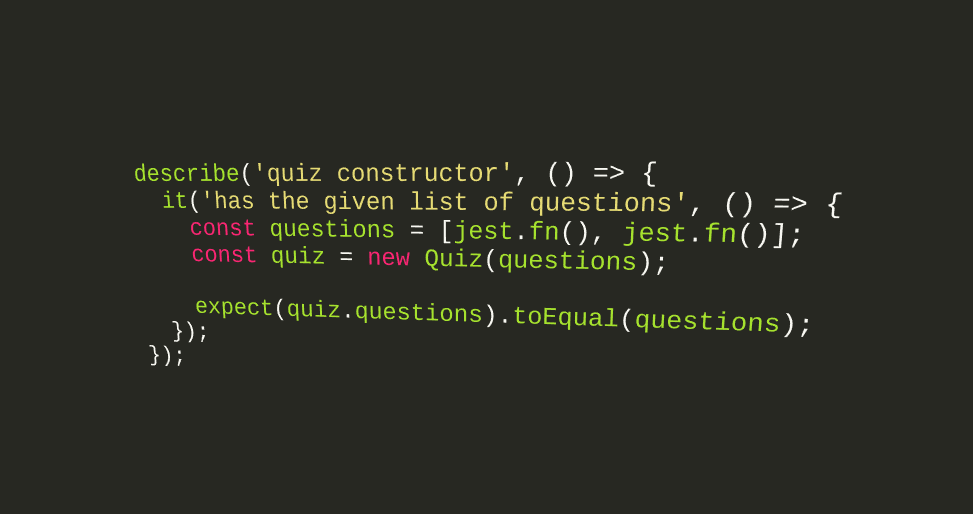

___A higher order function takes a function and returns a function. Jest offers a way to make sure the function you gave is being used right.___

Mock functions are also known as "spies", because they let you spy on the behavior of a function that is called indirectly by some other code, rather than just testing the output.

In Jest, doubles are generally always referred to as mocks
- Doubles are primarily created with `jest.fn()`
- Can be invoked like a function
- Keeps track of function calls
- Keeps track of instances when used as a constructor
- Can provide custom return values
- Can provide custom implementations

Example from [Cruise Ships](https://github.com/SharifCoding/cruise-ships) assignment;
Before applying mocks to `itinerary.test.js`:
```js
  const dover = new Port('Dover');
  const calais = new Port('Calais');
  const itinerary = new Itinerary([dover, calais]);
  expect(itinerary.ports).toEqual([dover, calais]);
```
Mocks `jest.fn()` applied to the test unit:
```js
  const ports = [jest.fn(), jest.fn()];
  const itinerary = new Itinerary(ports);
  expect(itinerary.ports).toEqual(ports);
```
[jest.fn() All the Things](https://medium.com/@deanslamajr/jest-fn-all-the-things-d26f3b929986)

[Mock Functions](https://facebook.github.io/jest/docs/en/mock-functions.html)

[Image Source](http://www.assertselenium.com/angularjs/protractor-jasmine-pre-post-processing-methods/)
